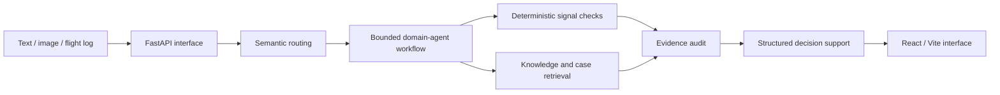

# UAV Fault Diagnosis: Research Showcase

**Knowledge-Graph-Enhanced Multi-Agent System for UAV Fault Diagnosis**

This repository is the public research showcase for a deployed UAV fault-
diagnosis prototype. It presents the problem, system architecture, user
interface, API boundary, and responsible-use constraints without publishing
the unpublished core reasoning implementation or production data.

## Overview

The prototype studies how a UAV maintenance assistant can combine natural-
language symptoms, optional flight logs, images, structured fault knowledge,
and deterministic signal checks. Its intended output is decision support:
ranked hypotheses, supporting evidence, uncertainty, an inspection order, and
a conservative operating boundary.

The system is not a flight controller, an autonomous repair authority, or a
replacement for qualified maintenance personnel.

## Research question

The focus is not whether a language model can write a plausible paragraph. The
research question is whether heterogeneous evidence can be routed, checked,
and presented with provenance while distinguishing a physical fault from
controller compensation, environmental disturbance, or insufficient evidence.

## Architecture at a glance



The domain roles cover propulsion, battery, avionics, vibration, and
environmental factors. The private archive contains the complete production
workflow; this repository keeps only the public interface and architectural
description.

## What is included

- the maintained React/Vite interface source and a system architecture image;
- a small FastAPI interface contract and an explicit public placeholder service;
- environment-variable examples with no real values;
- high-level architecture, data-governance, reproducibility, and demo notes;
- CI checks for Python syntax and frontend buildability.

## What is deliberately withheld

- complete multi-agent prompts and reasoning workflow;
- causal knowledge-graph contents and production Neo4j data;
- unpublished algorithms, private traces, user evidence, and raw datasets;
- production host paths, access credentials, deployment state, and model keys.

The withheld material is preserved separately in the private archive repository:
[`uav-fault-diagnosis-agent-archive`](https://github.com/LiFAN-WUST/uav-fault-diagnosis-agent-archive).

## Interface and local checks

The public backend files document the request/response contract only; they do
not claim to reproduce the private diagnosis engine. To inspect the UI:

```bash
cd frontend
npm ci
npm run build
```

To check the public Python interface:

```bash
python -m venv .venv
source .venv/bin/activate        # Windows: .venv\\Scripts\\Activate.ps1
python -m pip install -r backend/requirements.txt
python -m uvicorn main:app --app-dir backend --host 127.0.0.1 --port 8000
```

The public service exposes `/health` and returns an explicit “interface-only”
response for diagnosis calls. It must not be described as the complete
production engine.

## Demo

The accompanying demonstration material shows the deployed interface handling
a bounded UAV fault scenario and presenting an auditable report. Do not place
the production URL, reviewer credentials, user logs, or API keys in this
repository.

## Research status

**Manuscript in preparation.** Simulation results and prototype behavior are
not evidence of real-flight effectiveness. Any future release of core methods
or data requires a separate publication, provenance, intellectual-property,
and license review.

## License and contact

See [`LICENSE`](LICENSE) and [`SECURITY.md`](SECURITY.md). This showcase is
maintained by the project team at WUST; contact details are intentionally not
embedded in the public repository.
