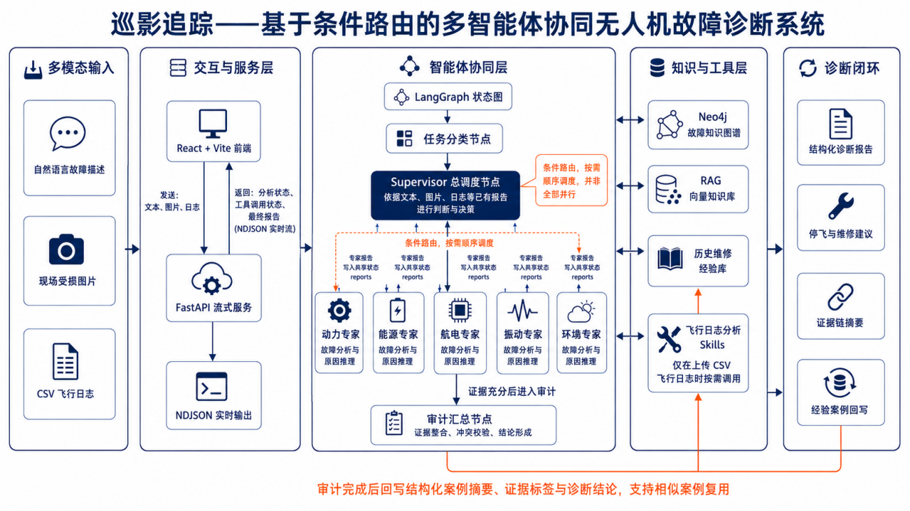

# Architecture and release boundary

The deployed prototype follows a bounded evidence workflow:

1. the interface accepts a symptom description and optional log/image data;
2. a router separates ordinary consultation from diagnosis requests;
3. only relevant domain roles are scheduled;
4. deterministic checks and structured retrieval provide supporting evidence;
5. an auditor separates observations, hypotheses, uncertainty, missing
   evidence, and recommended checks;
6. the UI presents a conservative, traceable decision-support report.

The roles are propulsion, battery, avionics, vibration, environment, and an
auditor. The workflow never authorizes flight or maintenance release.

The public repository intentionally stops at the architecture and interface
boundary. Complete prompts, causal-disambiguation logic, graph data, and
production wiring are retained in the private archive.

The image is a historical architecture illustration; its legacy working title
does not change the current project or release boundary.
